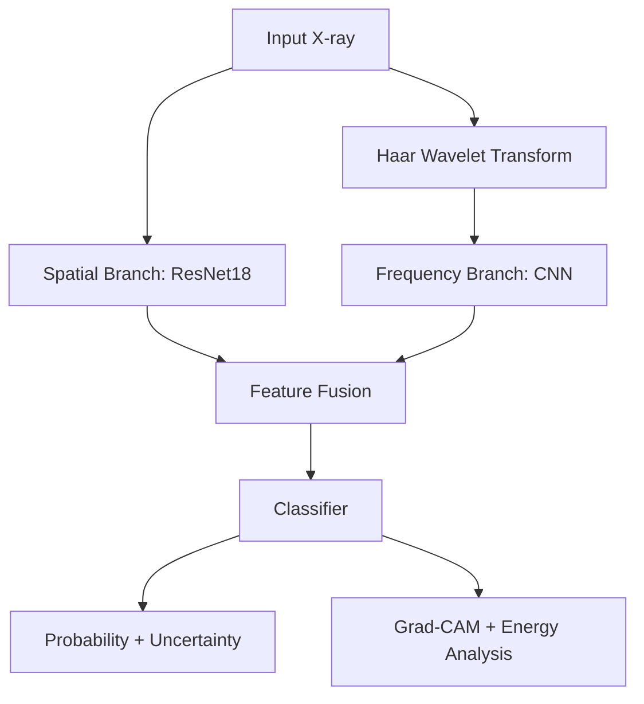

# haar-cxr-medical-ai
Haar-CXR: Dual-Branch Spatial + Haar Wavelet Pneumonia Detection Systemlink - https://haar-cxr-medical-ai-jrudfjradkr2zxk2wiu5pm.streamlit.app/OverviewHaar-CXR is a research-grade medical AI system for high-accuracy pneumonia detection from chest X-ray images. Unlike standard CNN-based approaches, Haar-CXR combines:Spatial deep learning (ResNet18)Frequency-domain signal analysis (Haar Wavelet Transform)Uncertainty estimation (MC Dropout)Explainability (Grad-CAM & Wavelet Energy Analysis)Mathematical Formulation1. Problem DefinitionGiven an input chest X-ray $x \in \mathbb{R}^{1 \times 224 \times 224}$, we perform binary classification $y \in \{0,1\}$ where 0 is Normal and 1 is Pneumonia. The model learns the mapping:$$f(x) = \hat{y}$$2. Spatial BranchThe spatial feature extractor $F_s$ uses a modified ResNet18 backbone to extract a feature vector of dimension $d=256$:$$F_s(x) = \text{ResNet18}(x) \in \mathbb{R}^{d}$$3. Haar Wavelet TransformWe apply a 1-level 2D Haar transform $W(x) = \{LL, LH, HL, HH\}$ where:LL (Approximation): $\frac{1}{2}(x_{00} + x_{01} + x_{10} + x_{11})$LH (Horizontal detail): $\frac{1}{2}(x_{00} - x_{01} + x_{10} - x_{11})$HL (Vertical detail): $\frac{1}{2}(x_{00} + x_{01} - x_{10} - x_{11})$HH (Diagonal detail): $\frac{1}{2}(x_{00} - x_{01} - x_{10} + x_{11})$The resulting wavelet coefficients $W(x) \in \mathbb{R}^{4 \times 112 \times 112}$ are processed by a dedicated Frequency Branch CNN:$$F_f(W(x)) = \text{CNN}(W(x)) \in \mathbb{R}^{d}$$4. Feature Fusion & PredictionWe concatenate both representations into a joint vector $z$:$$z = F_s(x) \oplus F_f(x), \quad z \in \mathbb{R}^{2d}$$The final prediction is passed through a sigmoid activation $\sigma$:$$\hat{y} = \sigma(Wz + b)$$5. Loss Function & CalibrationThe model is optimized using Binary Cross Entropy (BCE):$$\mathcal{L} = - \left[ y \log \sigma(\hat{y}) + (1-y)\log(1-\sigma(\hat{y})) \right]$$To ensure reliability, we measure Expected Calibration Error (ECE):$$ECE = \sum_{m=1}^{M} \frac{|B_m|}{n} |acc(B_m) - conf(B_m)|$$Explainability & UncertaintyUncertainty Estimation (Monte Carlo Dropout)We perform $T$ stochastic forward passes to compute the mean probability $\bar{y}$ and uncertainty $\sigma$:$$\bar{y} = \frac{1}{T}\sum \hat{y}_i, \quad \sigma = \sqrt{\frac{1}{T}\sum (\hat{y}_i - \bar{y})^2}$$Grad-CAMLocalized evidence is provided via heatmaps:$$L_{GradCAM} = ReLU\left(\sum_k \alpha_k A^k\right)$$System ArchitectureCode snippetgraph TD
    A[Input X-ray] --> B[Spatial Branch: ResNet18]
    A --> C[Haar Wavelet Transform]
    C --> D[Frequency Branch: CNN]
    B --> E[Feature Fusion]
    D --> E
    E --> F[Classifier]
    F --> G[Probability + Uncertainty]
    F --> H[Grad-CAM + Energy Analysis]
🛠 Tech StackML: PyTorch, PyWavelets, Scikit-learn, MLflowDeployment: Streamlit, DockerAnalysis: OpenCV, SciPy, Matplotlib⚠ DisclaimerThis system is for research purposes only and is not intended for clinical diagnosis.AuthorHarshith Devraj Applied Mathematics & ComputingMachine Learning | Medical AI | Signal Processing---

#  System Architecture



---

# 🛠 Tech Stack

## Core ML
- PyTorch
- Torchvision
- PyWavelets
- Scikit-learn
- SciPy

## Explainability & Analysis
- OpenCV
- Matplotlib
- Custom Grad-CAM
- MC Dropout

## MLOps & Deployment
- MLflow (Experiment Tracking)
- Streamlit (UI)
- Docker (Containerization)
- Virtualenv

---

#  Project Structure

```
haar_cxr/
│
├── configs/
├── src/
│   ├── models/
│   ├── training/
│   ├── evaluation/
│   ├── explainability/
│   ├── uncertainty/
│   └── inference/
│
├── cross_validate.py
├── train.py
├── app.py
├── Dockerfile
└── README.md
```

---

#  Running the Project

### Train (5-Fold CV)

```bash
python cross_validate.py
```

### Start MLflow

```bash
mlflow ui
```

### Launch App

```bash
streamlit run app.py
```

---

#  Docker Deployment

```bash
docker build -t haar-cxr .
docker run -p 8501:8501 haar-cxr
```

---

# ⚠ Disclaimer

This system is for research purposes only and is not intended for clinical diagnosis.

---

#  Project Significance

Haar-CXR demonstrates:

- Multi-domain feature learning
- Frequency-domain medical modeling
- Statistical validation
- Uncertainty-aware predictions
- Explainable AI compliance
- Ensemble robustness
- Production MLOps practices

This project bridges:

Medical AI × Signal Processing × Deep Learning × MLOps

---

##  Author

Harshith Devraj  
Applied Mathematics & Computing  
Machine Learning | Medical AI | Signal Processing


