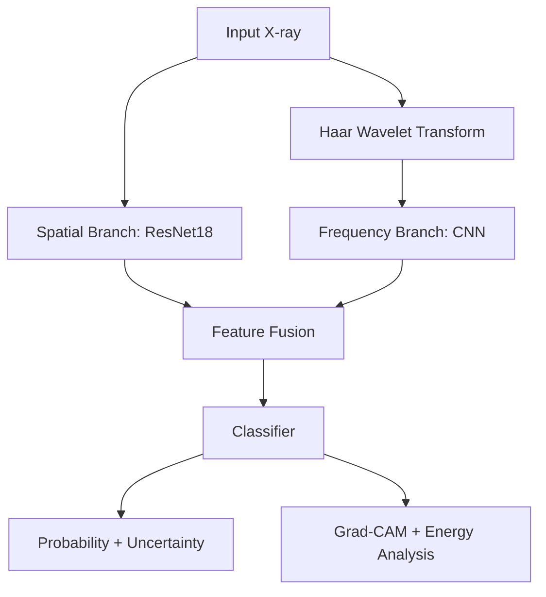

# haar-cxr-medical-ai

# 🩺 Haar-CXR: Dual-Branch Spatial + Haar Wavelet Pneumonia Detection System

---

##  Overview

**Haar-CXR** is a research-grade medical AI system for high-accuracy pneumonia detection from chest X-ray images.

Unlike standard CNN-based approaches, Haar-CXR combines:

- Spatial deep learning (ResNet18)
- Frequency-domain signal analysis (Haar Wavelet Transform)
- Feature fusion architecture
- Uncertainty estimation
- Calibration analysis
- Explainability (Grad-CAM)
- Statistical validation

The system is modular, reproducible, explainable, and production-ready.

---

#  Mathematical Formulation

## 1️⃣ Problem Definition

Given an input chest X-ray:

\[
x \in \mathbb{R}^{1 \times 224 \times 224}
\]

Binary classification:

\[
y \in \{0,1\}
\]

Where:
- 0 → Normal  
- 1 → Pneumonia  

The model learns:

\[
f(x) = \hat{y}
\]

---

## 2️⃣ Spatial Branch

The spatial feature extractor is a modified ResNet18:

\[
F_s(x) = \text{ResNet18}(x)
\]

Output feature vector:

\[
F_s(x) \in \mathbb{R}^{d}
\]

Default:

\[
d = 256
\]

---

## 3️⃣ Haar Wavelet Transform

We apply a 1-level 2D Haar transform:

\[
W(x) = \{LL, LH, HL, HH\}
\]

Where:

- **LL (Approximation):**

\[
\frac{1}{2}(x_{00} + x_{01} + x_{10} + x_{11})
\]

- **LH (Horizontal detail)**

\[
\frac{1}{2}(x_{00} - x_{01} + x_{10} - x_{11})
\]

- **HL (Vertical detail)**

\[
\frac{1}{2}(x_{00} + x_{01} - x_{10} - x_{11})
\]

- **HH (Diagonal detail)**

\[
\frac{1}{2}(x_{00} - x_{01} - x_{10} + x_{11})
\]

After transformation:

\[
W(x) \in \mathbb{R}^{4 \times 112 \times 112}
\]

---

## 4️⃣ Frequency Branch

Wavelet coefficients are processed by a CNN:

\[
F_f(W(x)) = \text{CNN}(W(x))
\]

Output:

\[
F_f(x) \in \mathbb{R}^{d}
\]

---

## 5️⃣ Feature Fusion

Concatenate both representations:

\[
z = F_s(x) \oplus F_f(x)
\]

\[
z \in \mathbb{R}^{2d}
\]

Final prediction:

\[
\hat{y} = \sigma(Wz + b)
\]

Where:

\[
\sigma(x) = \frac{1}{1 + e^{-x}}
\]

---

## 6️⃣ Loss Function

Binary Cross Entropy with logits:

\[
\mathcal{L} = - \left[ y \log \sigma(\hat{y}) + (1-y)\log(1-\sigma(\hat{y})) \right]
\]

Optimization:

\[
\theta_{t+1} = \theta_t - \alpha \nabla_\theta \mathcal{L}
\]

---

# 📊 Evaluation & Validation

## Stratified 5-Fold Cross-Validation

\[
\mu = \frac{1}{K}\sum_{k=1}^{K} AUC_k
\]

\[
\sigma = \sqrt{\frac{1}{K}\sum (AUC_k - \mu)^2}
\]

Reported metrics:

- Accuracy
- Precision
- Sensitivity (Recall)
- Specificity
- F1-score
- ROC-AUC
- Expected Calibration Error (ECE)

---

## Calibration (Expected Calibration Error)

\[
ECE = \sum_{m=1}^{M} \frac{|B_m|}{n} |acc(B_m) - conf(B_m)|
\]

Ensures predicted probabilities align with empirical outcomes.

---

## Uncertainty Estimation (Monte Carlo Dropout)

Perform \(T\) stochastic forward passes:

Mean probability:

\[
\bar{y} = \frac{1}{T}\sum \hat{y}_i
\]

Uncertainty:

\[
\sigma = \sqrt{\frac{1}{T}\sum (\hat{y}_i - \bar{y})^2}
\]

Confidence score:

\[
C = 1 - \sigma
\]

---

#  Explainability & Signal Analysis

## Grad-CAM

\[
L_{GradCAM} = ReLU\left(\sum_k \alpha_k A^k\right)
\]

Where:

\[
\alpha_k = \frac{1}{Z} \sum_i \sum_j \frac{\partial y}{\partial A_{ij}^k}
\]

Provides localized evidence for pneumonia regions.

---

## Wavelet Energy Analysis

Energy per band:

\[
E = \sum x^2
\]

Statistical comparison using independent t-test:

\[
t = \frac{\mu_1 - \mu_2}{\sqrt{\frac{s_1^2}{n_1} + \frac{s_2^2}{n_2}}}
\]

If \(p < 0.05\), the frequency band shows significant difference.

---

#  System Architecture



---

# 🛠 Tech Stack

## Core ML
- PyTorch
- Torchvision
- PyWavelets
- Scikit-learn
- SciPy

## Explainability & Analysis
- OpenCV
- Matplotlib
- Custom Grad-CAM
- MC Dropout

## MLOps & Deployment
- MLflow (Experiment Tracking)
- Streamlit (UI)
- Docker (Containerization)
- Virtualenv

---

#  Project Structure

```
haar_cxr/
│
├── configs/
├── src/
│   ├── models/
│   ├── training/
│   ├── evaluation/
│   ├── explainability/
│   ├── uncertainty/
│   └── inference/
│
├── cross_validate.py
├── train.py
├── app.py
├── Dockerfile
└── README.md
```

---

#  Running the Project

### Train (5-Fold CV)

```bash
python cross_validate.py
```

### Start MLflow

```bash
mlflow ui
```

### Launch App

```bash
streamlit run app.py
```

---

#  Docker Deployment

```bash
docker build -t haar-cxr .
docker run -p 8501:8501 haar-cxr
```

---

# ⚠ Disclaimer

This system is for research purposes only and is not intended for clinical diagnosis.

---

#  Project Significance

Haar-CXR demonstrates:

- Multi-domain feature learning
- Frequency-domain medical modeling
- Statistical validation
- Uncertainty-aware predictions
- Explainable AI compliance
- Ensemble robustness
- Production MLOps practices

This project bridges:

Medical AI × Signal Processing × Deep Learning × MLOps

---

##  Author

Harshith Devraj  
Applied Mathematics & Computing  
Machine Learning | Medical AI | Signal Processing

