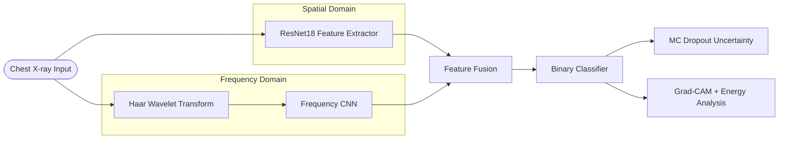

#  Haar-CXR  
### Dual-Branch Spatial + Haar Wavelet Medical AI System for Pneumonia Detection  

🔗 **Live Demo:**  
https://haar-cxr-medical-ai-jrudfjradkr2zxk2wiu5pm.streamlit.app/

---

##  Project Overview

**Haar-CXR** is a production-structured medical AI system designed for high-accuracy pneumonia detection from chest X-ray images.

Unlike standard CNN classifiers, this system integrates:

-  Spatial Deep Learning (ResNet18)
-  Frequency-Domain Signal Processing (Haar Wavelet Transform)
-  Feature Fusion Architecture
-  Statistical Validation
-  Calibration & Uncertainty Estimation
-  Grad-CAM Explainability
-  MLflow Experiment Tracking
-  Docker Deployment
-  Streamlit Live Application

This project demonstrates complete ML lifecycle ownership — from modeling and validation to deployment and explainability.

---

# 🏗 System Architecture

```
## 🏗 System Architecture



```

---

#  Core Technical Highlights

## 1️⃣ Dual-Branch Learning
- Extracts spatial representations using pretrained ResNet18  
- Captures frequency-domain features via 2D Haar wavelet transform  
- Fuses spatial and spectral embeddings for richer representation  

## 2️⃣ Robust Validation Strategy
- Stratified 5-Fold Cross-Validation  
- ROC-AUC, Accuracy, Precision, Recall, F1-score  
- Sensitivity & Specificity  
- Statistical significance testing (independent t-test)  

## 3️⃣ Calibration & Reliability
- Expected Calibration Error (ECE)  
- Monte Carlo Dropout for predictive uncertainty  
- Confidence scoring mechanism  

## 4️⃣ Explainable AI
- Grad-CAM heatmap visualization  
- Wavelet band energy comparison  
- Confidence-aware predictions  

---

# 📊 Engineering Stack

## 🧠 Core ML Stack

<p align="left">


</p>

## ⚙️ MLOps & Deployment

<p align="left">


</p>


---

# 📁 Production-Grade Project Structure

```
haar_cxr/
│
├── configs/
├── src/
│   ├── models/
│   ├── training/
│   ├── evaluation/
│   ├── explainability/
│   ├── uncertainty/
│   └── inference/
│
├── cross_validate.py
├── train.py
├── app.py
├── Dockerfile
└── README.md
```

---

# ▶️ How to Run

### Train with Cross Validation
```bash
python cross_validate.py
```

### Start MLflow
```bash
mlflow ui
```

### Launch Streamlit App
```bash
streamlit run app.py
```

### Docker Deployment
```bash
docker build -t haar-cxr .
docker run -p 8501:8501 haar-cxr
```

---

#  What This Project Demonstrates

- Advanced architecture design (multi-branch learning)  
- Signal processing integration into deep learning pipelines  
- Model calibration & uncertainty quantification  
- Explainable AI for medical compliance  
- Clean modular production structure  
- End-to-end ML lifecycle ownership  
- Deployment-ready ML system  

---

# ⚠ Disclaimer

This system is for research purposes only and is not intended for clinical diagnosis.

---

# 👨‍💻 Author

**Harshith Devraj**  
M.Sc. Applied Mathematics & Computing  
Machine Learning | Medical AI | Signal Processing  
