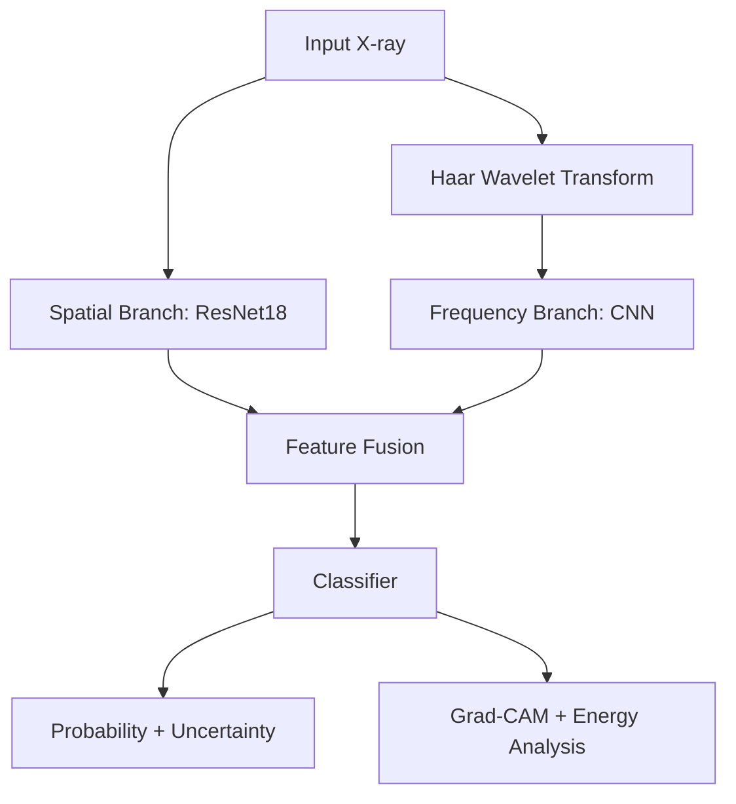

# haar-cxr-medical-ai
Dual-Branch Spatial + Haar Wavelet Medical AI System for Pneumonia Detection

🔗 Live App:
https://haar-cxr-medical-ai-jrudfjradkr2zxk2wiu5pm.streamlit.app/

🚀 Why This Project Stands Out

Haar-CXR is not a basic CNN classifier.

It is a production-structured medical AI system that combines:

🧠 Deep Learning (ResNet18)

📊 Signal Processing (Haar Wavelet Transform)

🔀 Feature Fusion Architecture

📈 Statistical Validation

🎯 Calibration & Uncertainty Estimation

🔍 Grad-CAM Explainability

⚙️ MLOps with MLflow

🐳 Docker Deployment

🌐 Live Streamlit Deployment

This project demonstrates:

Medical AI × Signal Processing × Deep Learning × MLOps Engineering

🏗 System Architecture
Input X-ray
      │
      ├── Spatial Branch (ResNet18)
      │
      ├── Haar Wavelet Transform
      │        └── Frequency CNN Branch
      │
      ├── Feature Fusion
      │
      ├── Binary Classifier
      │
      ├── Uncertainty (MC Dropout)
      │
      └── Explainability (Grad-CAM + Wavelet Energy)

🧠 Core Technical Highlights
1️⃣ Dual-Branch Learning

Spatial representation via pretrained ResNet18

Frequency-domain modeling using 2D Haar transform

Fusion of spatial + spectral embeddings

2️⃣ Robust Validation

Stratified 5-Fold Cross Validation

ROC-AUC, F1, Sensitivity, Specificity

Statistical significance testing (t-test)

3️⃣ Calibration & Reliability

Expected Calibration Error (ECE)

Probability alignment validation

Monte Carlo Dropout for predictive uncertainty

4️⃣ Explainable AI

Grad-CAM heatmaps

Wavelet band energy analysis

Confidence scoring

#  System Architecture



---

# 🛠 Tech Stack

## Core ML
- PyTorch
- Torchvision
- PyWavelets
- Scikit-learn
- SciPy

## Explainability & Analysis
- OpenCV
- Matplotlib
- Custom Grad-CAM
- MC Dropout

## MLOps & Deployment
- MLflow (Experiment Tracking)
- Streamlit (UI)
- Docker (Containerization)
- Virtualenv

---

#  Project Structure

```
haar_cxr/
│
├── configs/
├── src/
│   ├── models/
│   ├── training/
│   ├── evaluation/
│   ├── explainability/
│   ├── uncertainty/
│   └── inference/
│
├── cross_validate.py
├── train.py
├── app.py
├── Dockerfile
└── README.md
```

---

#  Running the Project

### Train (5-Fold CV)

```bash
python cross_validate.py
```

### Start MLflow

```bash
mlflow ui
```

### Launch App

```bash
streamlit run app.py
```

---

#  Docker Deployment

```bash
docker build -t haar-cxr .
docker run -p 8501:8501 haar-cxr
```

---

# ⚠ Disclaimer

This system is for research purposes only and is not intended for clinical diagnosis.

---

#  Project Significance

Haar-CXR demonstrates:

- Multi-domain feature learning
- Frequency-domain medical modeling
- Statistical validation
- Uncertainty-aware predictions
- Explainable AI compliance
- Ensemble robustness
- Production MLOps practices

This project bridges:

Medical AI × Signal Processing × Deep Learning × MLOps

---

##  Author

Harshith Devraj  
Applied Mathematics & Computing  
Machine Learning | Medical AI | Signal Processing


